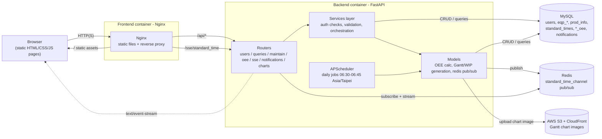
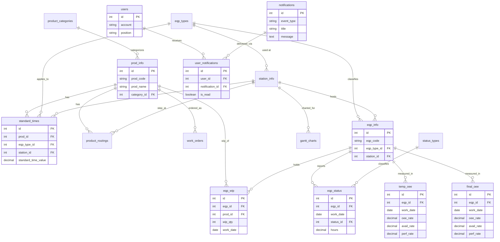
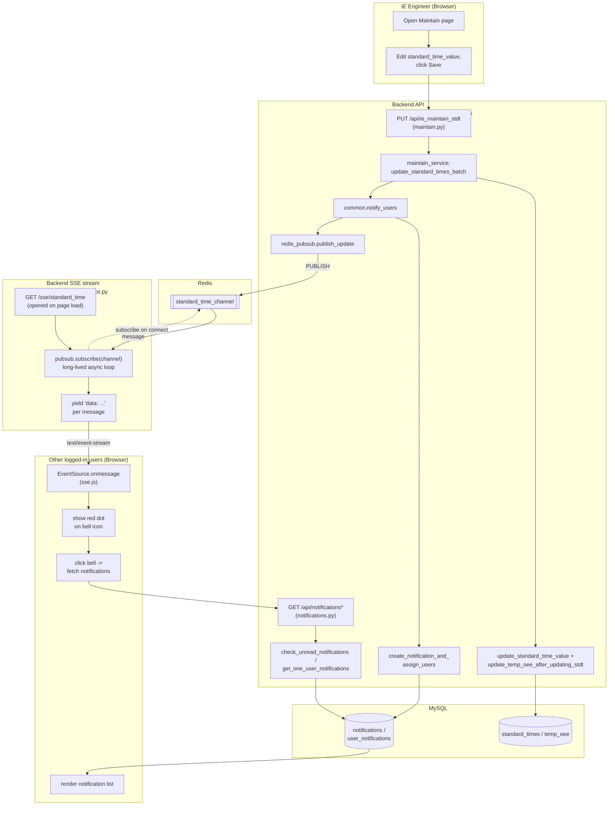

# YourFirstCIM

A Computer Integrated Manufacturing (CIM) system for monitoring and managing manufacturing operations, featuring real-time equipment status tracking, OEE (Overall Equipment Effectiveness) analytics, and production management.

## Overview

YourFirstCIM is a full-stack web application that provides comprehensive manufacturing execution system capabilities including:

- Real-time equipment status monitoring
- OEE (Overall Equipment Effectiveness) calculation and visualization
- Gantt chart views for production scheduling
- Equipment maintenance management
- WIP (Work in Progress) tracking
- Production data queries and analytics
- Real-time notifications via Server-Sent Events (SSE)

## Tech Stack

### Backend
- **Framework**: FastAPI 0.110.0
- **Server**: Uvicorn 0.29.0
- **Database**: MySQL (via SQLAlchemy 2.0.29)
- **Cache**: Redis 7.0
- **Authentication**: JWT (PyJWT 2.8.0, python-jose 3.3.0)
- **File Storage**: AWS S3 (boto3)
- **Scheduling**: APScheduler 3.10.4
- **Data Visualization**: Matplotlib 3.8.4

### Frontend
- **UI**: Static HTML5, SCSS/CSS, vanilla JavaScript (`frontend/static/`)
- **Real-time client**: `EventSource` (SSE) for live notifications
- **Web Server**: Nginx (serves static assets, reverse-proxies `/api` and `/sse` to the backend)

> `frontend/cimapp/` contains an unused `create-react-app` scaffold kept from early prototyping; it is not built or served in production (see [Dockerfile](frontend/Dockerfile)).

### Infrastructure
- **Containerization**: Docker & Docker Compose
- **Cache/Message Broker**: Redis 7.0

## Project Structure

```
yourfirstcim/
├── backend/
│   ├── app/
│   │   ├── db/              # Database connection, table schema, and CRUD/query operations
│   │   ├── models/          # Domain logic (OEE calc, Gantt/WIP generation, Redis pub/sub, notifications)
│   │   ├── routers/         # API route handlers (thin controllers)
│   │   ├── services/        # Business logic invoked by routers (validation, orchestration)
│   │   └── main.py          # FastAPI application entry point
│   └── requirements.txt     # Python dependencies
├── frontend/
│   ├── cimapp/              # Unused create-react-app scaffold (not served)
│   ├── static/              # HTML/CSS/JS source served in production
│   └── nginx.conf           # Nginx configuration
├── test/                    # Test files
├── docker-compose.yml       # Docker services configuration
└── .env.example             # Environment variables template
```

## Features

### Dashboard Pages
- **Dashboard**: Main overview of manufacturing operations
- **Equipment Gantt Chart**: Visual timeline of equipment usage
- **OEE Analytics**: Overall Equipment Effectiveness metrics
- **Equipment Status Query**: Real-time equipment status lookup
- **WIP Query**: Work in Progress tracking
- **Equipment Maintenance**: Maintenance records and scheduling
- **IE Maintenance**: Industrial Engineering maintenance tasks
- **IE Query**: Industrial Engineering data queries
- **Notifications**: Real-time system alerts

### API Capabilities
- User authentication and authorization
- Real-time data streaming via SSE
- Equipment status monitoring
- Production data queries
- Maintenance record management
- OEE calculation and reporting
- Chart generation and visualization
- Scheduled daily jobs for data processing

## Getting Started

### Prerequisites
- Docker and Docker Compose
- MySQL database
- AWS account (for S3 storage)
- Redis (included in docker-compose)

### Environment Setup

1. Copy the environment template:
```bash
cp .env.example .env
```

2. Configure environment variables in `.env`:
```env
# MySQL Configuration
MYSQL_HOST=your_host
MYSQL_ROOT_USER=your_root_user
MYSQL_ROOT_USER_PASSWORD=your_root_user_password
MYSQL_USER=your_username
MYSQL_PASSWORD=your_password
MYSQL_DATABASE=your_database_name
MYSQL_PORT=your_database_port

# AWS Configuration
AWS_ACCESS_KEY_ID=your_aws_access_key_id
AWS_SECRET_ACCESS_KEY=your_aws_secret_access_key
AWS_REGION=your_aws_region
AWS_BUCKET=your_aws_bucket_name
CLOUDFRONT_DOMAIN=your_cloudfront_domain
```

### Installation & Running

#### Using Docker Compose (Recommended)

1. Build and start all services:
```bash
docker-compose up -d
```

2. Access the application:
- Frontend: http://localhost
- Backend API: http://localhost:8000
- API Documentation: http://localhost:8000/docs
- Redis: localhost:6379

3. Stop the services:
```bash
docker-compose down
```

#### Local Development

**Backend:**
```bash
cd backend
pip install -r requirements.txt
uvicorn app.main:app --reload --host 0.0.0.0 --port 8000
```

**Frontend:**
The UI is static HTML/CSS/JS served directly by the backend (see the routes in [main.py](backend/app/main.py)) or via Nginx in Docker — no build step is required. For local editing, simply run the backend and open http://localhost:8000, or serve `frontend/static/` with any static file server.

**Redis:**
```bash
docker run -d -p 6379:6379 redis:7.0-alpine
```

## API Documentation

Once the backend is running, visit:
- Swagger UI: http://localhost:8000/docs
- ReDoc: http://localhost:8000/redoc

## Development

### Backend Development
The backend follows a **router → service → data-access** layering:
- **Routers** (`backend/app/routers/`) — thin controllers that parse the request and delegate to a service
  - [charts.py](backend/app/routers/charts.py) - Chart generation endpoints
  - [users.py](backend/app/routers/users.py) - User management
  - [queries.py](backend/app/routers/queries.py) - Data query endpoints
  - [maintain.py](backend/app/routers/maintain.py) - Maintenance management
  - [sse.py](backend/app/routers/sse.py) - Server-sent events
  - [notifications.py](backend/app/routers/notifications.py) - Notification system
  - [oee.py](backend/app/routers/oee.py) - OEE calculations
  - [daily_jobs.py](backend/app/routers/daily_jobs.py) - APScheduler job definitions
- **Services** (`backend/app/services/`) — business logic, authorization, and orchestration called by the routers above (e.g. [maintain_service.py](backend/app/services/maintain_service.py), [oee_service.py](backend/app/services/oee_service.py), [sse_service.py](backend/app/services/sse_service.py), [common.py](backend/app/services/common.py) for shared notification helpers)
- **Models & DB** (`backend/app/models/`, `backend/app/db/`) — OEE/Gantt/WIP generation, Redis pub/sub, and MySQL CRUD/query functions

### Frontend Development
The frontend is a set of static, server-rendered-free HTML pages (`frontend/static/*.html`) styled with SCSS and progressively enhanced with vanilla JS modules (`frontend/static/js/`), one file per page. FastAPI serves these pages directly in development; Nginx serves them (and proxies API/SSE calls to the backend) in production.

## Architecture

### System Diagram



### Services
1. **Backend**: FastAPI application handling business logic and API endpoints
2. **Frontend**: Static HTML/CSS/JS pages served by Nginx
3. **Redis**: Pub/sub broker for real-time notifications
4. **MySQL**: Primary data store (external)
5. **AWS S3**: Gantt chart image storage (external)

### Key Features
- **APScheduler**: Automated daily jobs for data processing
- **SSE**: Real-time updates without WebSocket complexity
- **Redis Pub/Sub**: Real-time notification broadcasting
- **JWT Authentication**: Secure user authentication
- **SQLAlchemy ORM**: Type-safe database operations

## Database Schema

Core tables and relationships, as defined in [tables.py](backend/app/db/tables.py):



> `temp_oee` holds the as-recalculated (would-be) OEE used to preview the impact of a standard-time change before it is committed to `final_oee`, which stores the finalized daily OEE figures shown on the dashboard.

## Real-Time Notification Flow (Redis & SSE Flow)

When an IE engineer updates standard times, every other logged-in user is notified live, without polling or WebSockets. main's README linked a drawio swimlane image for this (`img/drawio.png`); the diagram below reconstructs that flow in Mermaid, based on how [maintain_service.py](backend/app/services/maintain_service.py), [common.py](backend/app/services/common.py), [redis_pubsub.py](backend/app/models/redis_pubsub.py) and [sse_service.py](backend/app/services/sse_service.py) actually wire together.

### Swimlane View



Key things this diagram captures about how the project actually behaves:
- The SSE connection (`L5`) is opened once per page load and stays alive independently of any particular update — it is a long-running subscriber, not a request/response call.
- `publish_update` (`L2`→`L4`) and the SSE subscriber loop (`L5`) are decoupled through Redis: the maintain flow never talks to connected browsers directly, so it doesn't need to know who's listening.
- The SSE payload itself only carries a lightweight signal (`sse.js` just flips a red dot); the actual notification content is fetched afterwards via the regular `/api/notifications*` REST endpoints, not pushed through SSE. This keeps the pub/sub channel generic and the notification data consistent with what's stored in MySQL.
- Because Redis pub/sub has no message durability, a browser that isn't connected at publish time (e.g. it reconnects) will miss the SSE ping — but it still self-corrects on next page load / bell click via `GET /api/notifications/unread`, which reads from MySQL directly.

### Sequence View

```mermaid
sequenceDiagram
    actor IE as IE Engineer
    participant Maintain as Maintain page (browser)
    participant API as /api/ie_maintain_stdt (router + service)
    participant DB as MySQL
    participant PubSub as redis_pubsub.publish_update
    participant Redis as Redis (standard_time_channel)
    participant SSE as /sse/standard_time (sse_service)
    actor Other as Other logged-in users

    Other->>SSE: GET /sse/standard_time (EventSource, on page load)
    activate SSE
    Note over Other,SSE: Connection stays open; SSE subscribes to standard_time_channel

    IE->>Maintain: Edit standard time(s), submit
    Maintain->>API: PUT/POST standard time batch
    API->>DB: update_standard_time_value / recalc temp_oee
    API->>DB: create_notification_and_assign_users
    API->>PubSub: publish_update(message, user_id)
    PubSub->>Redis: PUBLISH standard_time_channel
    Redis-->>SSE: message on standard_time_channel
    SSE-->>Other: data: {event, message, user_id}
    deactivate SSE
    Other->>Other: show red dot on bell icon (sse.js)
    Other->>API: GET /api/notifications/unread, /api/notifications
    API->>DB: check_unread_notifications / get_one_user_notifications
    DB-->>Other: notification list rendered in UI
```

## Testing

Backend tests are located in the [test/](test/) directory.

```bash
cd test
python -m pytest
```

## Deployment

The application is containerized and can be deployed using Docker Compose. For production:

1. Configure SSL certificates in [frontend/certs/](frontend/certs/)
2. Update [frontend/nginx.conf](frontend/nginx.conf) with production settings
3. Set production environment variables
4. Deploy using `docker-compose.yml`

## License

This project is part of the WeHelp Bootcamp training program.

## Contributing

This is a training project. For questions or issues, please contact the project maintainer.
